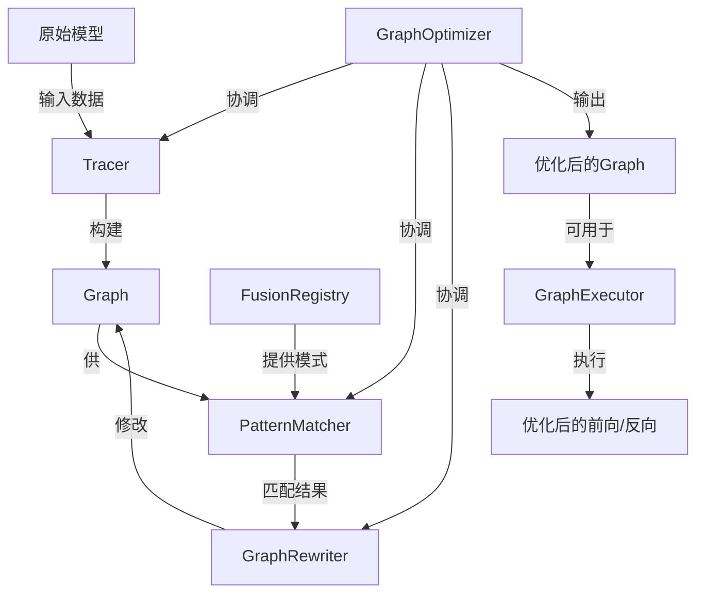

要实现“先执行一次前向，记录完整计算图，然后进行模式识别和替换，实现算子融合”，需要以下几个核心模块及其关系：

### 1. 图记录模块（GraphTracer / Tracer）
- **职责**：执行一次前向传播，记录计算图中所有 `Function` 节点和 `Tensor` 节点之间的依赖关系。
- **实现要点**：在 `Function.__call__` 中增加记录逻辑（通过配置开关控制），将当前 `Function` 及其输入输出 `Tensor` 的引用关系存储到一个全局或上下文中的图结构中。
- **输出**：一个完整的计算图对象 `Graph`，包含节点列表、边列表（数据流与控制依赖）。

### 2. 计算图数据结构（Graph）
- **职责**：存储计算图的拓扑结构，提供节点遍历、查找、替换等操作接口。
- **内容**：
  - 节点：`FunctionNode`（对应 `Function` 实例）和 `TensorNode`（对应 `Tensor` 实例）。
  - 边：从 `TensorNode` 到 `FunctionNode`（作为输入）以及从 `FunctionNode` 到 `TensorNode`（作为输出）。
- **关系**：由 `Tracer` 构建，后续被 `PatternMatcher` 和 `GraphRewriter` 使用。

### 3. 模式匹配模块（PatternMatcher）
- **职责**：在 `Graph` 中查找预定义的算子融合模式（如 `Conv2d` → `ReLU`、`Conv2d` → `BatchNorm2d` → `ReLU`）。
- **实现要点**：定义模式描述（例如节点类型序列、输入输出匹配条件），利用图遍历算法（如拓扑序、子图同构）找到所有匹配的子图。
- **输出**：匹配结果列表，每个结果包含子图中的节点集合和连接关系。

### 4. 图重写模块（GraphRewriter）
- **职责**：根据匹配结果将子图替换为融合后的单个 `Function` 节点（如 `FusedConvReLU`）。
- **操作**：
  - 创建融合 `Function` 实例。
  - 连接原子图的输入 `Tensor` 到新节点，新节点的输出连接到原子图的输出 `Tensor`。
  - 删除或屏蔽原子图节点，并更新 `Graph` 中的依赖关系。
- **关系**：依赖 `Graph` 提供的修改接口，可能需更新 `Tensor.creator` 和 `Function.inputs/outputs` 等属性。

### 5. 融合算子注册表（FusionRegistry）
- **职责**：管理可融合的模式与对应的融合算子类/工厂函数之间的映射。
- **内容**：例如 `{ (Conv2d, ReLU): FusedConvReLU, (Conv2d, BatchNorm2d, ReLU): FusedConvBNReLU }`。
- **关系**：`PatternMatcher` 查询注册表获取可匹配的模式；`GraphRewriter` 根据模式创建对应的融合算子实例。

### 6. 图优化调度器（GraphOptimizer）
- **职责**：协调上述模块完成“记录→匹配→替换”的整体流程。
- **流程**：
  1. 调用 `Tracer` 执行一次前向，得到 `Graph`。
  2. 使用 `PatternMatcher` 和 `FusionRegistry` 找出所有可融合子图。
  3. 调用 `GraphRewriter` 逐一替换子图，生成优化后的 `Graph`。
  4. （可选）将优化后的 `Graph` 保存为可执行对象，用于后续训练/推理的前向和反向。

### 7. 图执行器（GraphExecutor，可选）
- **职责**：使用优化后的 `Graph` 代替原有的动态执行流程，进行高效的前向和反向计算。
- **关系**：`GraphOptimizer` 输出 `Graph` 后，可替换模型的 `forward` 方法为 `GraphExecutor` 的调用，从而实现后续迭代直接使用融合算子。

### 模块间关系图

### 与现有框架的关系

- **`core.py` 中的 `Function` 和 `Tensor`**：需增加图记录钩子（例如通过全局配置 `RECORD_GRAPH`）。
- **`functions.py` 中的具体算子**：无需修改，因为记录在 `Function.__call__` 中统一完成。
- **`module.py` 中的 `Layer`/`Module`**：可保持不变；`GraphOptimizer` 仅操作计算图，不改变模型结构（也可选择同时修改模型结构以实现持久融合）。
- **`trainer.py`**：可在首次迭代前调用 `GraphOptimizer.optimize(model, sample_input)`，然后用优化后的执行器替换模型的前向逻辑。

通过上述模块的协作，可以在不侵入原有动态图核心的前提下，实现一次前向记录、模式识别和算子融合的完整流程。