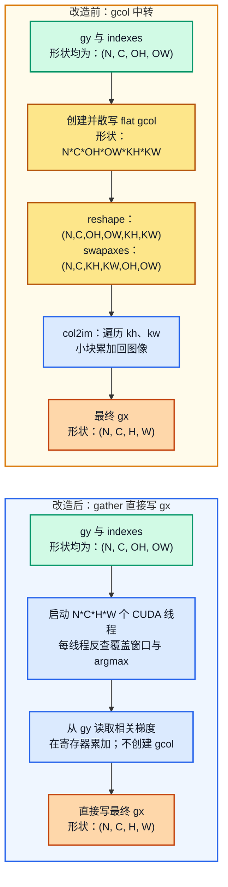

# M1-06 / M1-07 CUDA 改写汇报材料

> 面向第一次接触 CUDA 的组员；汇报时长约 5 分钟

## 0. 先理解我们在改什么

CUDA 的基本想法很简单：CPU 负责组织任务，GPU 同时启动很多个小线程来处理相同类型的计算。例如，一张特征图有很多像素，就可以让“一个 GPU 线程负责一个像素”或“一个 GPU 线程负责一个输出位置”。

当前 EnNeuro 已经可以在 GPU 上运行，但主要是把多个 CuPy 数组操作串起来。CuPy 会帮我们调用 GPU kernel，不过一次 Python/CuPy 操作通常对应一次 kernel 启动，还会产生中间数组。我们这次要做的不是重写整个框架，而是把最耗时的几段操作合并成一个手写 CUDA kernel；如果新 kernel 不适用，就继续走原来的 CuPy 路径。

### 0.1 Python 和 CUDA C 各自负责什么

这里容易产生一个误解：改写前并不是“Python 自己逐个像素计算”，改写后也不是“所有事情都交给 CUDA C”。两种版本通常都是 Python + GPU 的组合，只是分工不同：

| 部分 | 改造前 | 改造后 |
|---|---|---|
| Python | 调用多个 CuPy 操作，负责 reshape、索引、循环和临时数组管理 | 准备参数和输出数组，只调用一个或少数几个 kernel |
| GPU 计算 | CuPy 根据每个表达式分别启动通用 kernel | 我们用 CUDA C 明确规定“一个线程负责哪个输出位置” |
| 中间数据 | 经常先生成 `gcol`、`y_buffer` 等数组，再交给下一步 | 尽量在一个 kernel 内完成读取、计算和写回 |

因此，CUDA C 并不是因为“语言本身更快”而更优。CuPy 底层同样使用 GPU 多线程。手写 kernel 可能更快，主要因为我们可以：

- 减少 kernel 启动次数；
- 不生成用完即丢的大型中间数组；
- 按数据布局安排连续读写和线程分工；
- 把边界判断、累加和写回合并到同一个 kernel。

如果手写 kernel 的线程分配或内存访问设计得不好，它也可能比 CuPy/cuDNN 更慢，所以必须用正确性测试和 CUDA Event 实测来决定是否采用。

下面两个模块都按同一个顺序说明：

1. 当前代码做了什么、哪里可以改；
2. 最推荐的改写方案；
3. 一个具体的改写示例（改造前、改造后、差异）；
4. 其他方案，以及它们和首选方案的取舍。

---

## 1. M1-06：卷积 / 池化反向 kernel

### 1.1 当前方法：已有内容和可修改点

#### 卷积反向

卷积反向主要需要计算两类梯度：

- `gx`：对输入的梯度，告诉前一层每个输入像素应该得到多少梯度；
- `gW`：对卷积核权重的梯度，告诉训练过程权重应该怎样更新。

当前 `functions.py` 的做法大致是：

```text
上游梯度 gy
    ↓
tensordot（把 gy 和卷积核相乘）
    ↓
得到很大的 gcol 临时数组
    ↓
col2im（把临时数组加回输入位置）
    ↓
得到 gx
```

这里有三个明显的可修改点：

1. `tensordot` 会先产生一个比最终 `gx` 大很多的中间数组；
2. `col2im_array` 通过 Python 循环处理 `KH×KW` 个窗口位置，3×3 卷积就有多次 GPU 操作；
3. `gW` 目前需要重新做一遍 `im2col`，前向已经算过的中间结果没有充分复用。

#### 池化反向

当前 MaxPool 反向的代码在 `Pooling2DGrad.forward` 中，步骤是：

```text
保存前向 argmax（最大值在窗口中的位置）
    ↓
创建放大的 gcol
    ↓
把 gy 按 argmax 散写到 gcol
    ↓
调用 col2im，把 gcol 加回 gx
```

例如 2×2 池化，`gcol` 的元素数量约为 `gy` 的 4 倍。池化本身计算很简单，但中间数组和多次 kernel 启动反而成了主要开销。因此池化反向是最适合先改写的模块。

#### 图解：MaxPool 反向中 `gcol` 到底做了什么

下图对应当前 `Pooling2DGrad.forward` 的真实数据流。这里的 `N` 是 batch 大小，`C` 是通道数，`H/W` 是池化前图像尺寸，`OH/OW` 是池化输出尺寸，`KH/KW` 是池化窗口尺寸。



改造前，对于每一张图、每一个通道，`gy[n,c]` 原本只是一个 `OH×OW` 的小矩阵。代码把其中每个标量 `gy[n,c,oh,ow]` 扩展为一个 `KH×KW` 的小窗口：窗口中只有 `indexes[n,c,oh,ow]` 指定的位置填入该梯度，其余位置为 0。于是它在逻辑上变为：

```text
gy[n,c]：                    (OH, OW)
每个 gy 标量对应的窗口：      (KH, KW)
全部窗口合起来的 gcol[n,c]：  (OH, OW, KH, KW)
交换维度后：                  (KH, KW, OH, OW)
```

其中完整 `gcol` 的形状是 `(N, C, KH, KW, OH, OW)`。维度交换不是数学计算，只是让 `col2im` 更容易按固定的 `(kh, kw)` 位置取出所有输出窗口的数据，再执行加法写回。

#### 一个 4×4 图像的具体例子

假设 `N=C=1`，输入图像为 `4×4`，MaxPool 使用 `2×2` 窗口、stride=2、padding=0。此时 `gy` 和 `indexes` 的形状都是 `(1,1,2,2)`：

```text
gy[0,0] =                 indexes[0,0] =
┌─────┬─────┐             ┌─────┬─────┐
│  a  │  b  │             │  3  │  0  │
├─────┼─────┤             ├─────┼─────┤
│  c  │  d  │             │  2  │  1  │
└─────┴─────┘             └─────┴─────┘

index 0/1/2/3 分别代表 2×2 窗口的左上 / 右上 / 左下 / 右下。
```

改造前，四个 `gy` 标量会各自变成一个 `2×2` 局部块，也就是 `gcol[0,0,oh,ow,:,:]`：

```text
输出位置 (oh,ow)       对应的 gcol 局部块
(0,0), gy=a, index=3   [[0, 0], [0, a]]
(0,1), gy=b, index=0   [[b, 0], [0, 0]]
(1,0), gy=c, index=2   [[0, 0], [c, 0]]
(1,1), gy=d, index=1   [[0, d], [0, 0]]
```

`col2im` 再根据窗口位置把这四块放回 `4×4` 图像。因为本例 stride=2，窗口没有重叠，最终 `gx` 为：

```text
gx[0,0] =
┌─────┬─────┬─────┬─────┐
│  0  │  0  │  b  │  0  │
├─────┼─────┼─────┼─────┤
│  0  │  a  │  0  │  0  │
├─────┼─────┼─────┼─────┤
│  0  │  0  │  0  │  d  │
├─────┼─────┼─────┼─────┤
│  c  │  0  │  0  │  0  │
└─────┴─────┴─────┴─────┘
```

改造后，不再创建这四个 `2×2` 局部块。GPU 直接启动 `N×C×H×W=16` 个线程；例如负责 `gx[0,0,1,1]` 的线程会反查到它属于输出窗口 `(oh,ow)=(0,0)`，再检查 `indexes[0,0,0,0]=3` 恰好对应窗口右下位置，于是把 `gy[0,0,0,0]=a` 写入这个 `gx` 位置。每个线程都做同样的反查，最终得到完全相同的 `gx`。

当 stride 小于窗口尺寸时，窗口会重叠。改造前由 `col2im` 的多次 `+=` 完成重叠区域求和；改造后由“该输入像素对应的一个线程”读取所有覆盖它的 `gy` 并在寄存器中求和。数学结果相同，只是求和的位置从大中间数组转移到了单个线程内部。

> 卷积 `gx` 的形状变化与 MaxPool 很像，但 `gcol` 的内容不同：MaxPool 的每个 `KH×KW` 局部块只有 argmax 位置非零；卷积的 `gcol` 先由 `W` 和 `gy` 相乘得到，局部块中的多个位置都可能有值。首选 gather 卷积 kernel 同样跳过 `gcol`，直接让一个线程计算一个 `gx[n,c,h,w]`，在内部累加所有有效的 `gy×W` 项。

### 1.2 最推荐的改写方案：gather 型 col2im

“gather”可以直译为“主动去读取”。改造后不再让输出梯度先写入一个大 `gcol`，而是让每个 GPU 线程直接负责一个输入像素：

1. 线程先确定自己负责的输入位置 `(n, c, h, w)`；
2. 反向检查这个像素被哪些池化窗口或卷积窗口覆盖；
3. 直接从 `gy` 读取对应梯度，累加后写入 `gx[n,c,h,w]`。

所以，首选方案中的 CUDA C 算子并不是“让不同线程分别算 `gcol` 的不同片段”。恰恰相反，它的目标是跳过 `gcol`：不同线程分别计算不同的 `gx` 输入位置，每个线程自己反查相关窗口并完成累加。若采用另一种 scatter 方案，才会更接近“一个线程处理一个输出窗口，再把结果写入 gcol 或 gx”；这时多个线程可能写同一位置，需要 `atomicAdd`，速度和确定性都会受到影响。

这个方案的优点是：

- 不创建 `gcol`，显著降低显存峰值；
- 每个线程只写一个 `gx` 位置，不需要多个线程抢写同一个地址；
- 不使用 `atomicAdd`，两次运行可以保持一致，便于测试；
- 同一个思路可以复用于 MaxPool 反向、卷积 `gx` 和 dilation 分支。

第一版建议只改“数据搬运和窗口累加”，矩阵乘法仍交给 CuPy/cuBLAS。cuBLAS 是 NVIDIA 已经优化好的矩阵乘法库，我们没有必要在第一版重新写 GEMM。

### 1.3 改写示例：MaxPool 反向

#### 改造前：Python/CuPy 版本

下面是当前逻辑的简化版。它的重点是先创建 `gcol`，再调用 `col2im`：

```python
def maxpool_backward_before(gy, indexes, input_shape,
                            kernel_size, stride, pad):
    N, C, OH, OW = gy.shape
    N, C, H, W = input_shape
    KH, KW = kernel_size
    xp = get_array_module(gy)

    # 第一步：创建 KH*KW 倍大小的临时数组
    gcol = xp.zeros(N * C * OH * OW * KH * KW,
                    dtype=gy.dtype)

    # 第二步：按 argmax 把 gy 散写进去
    offsets = (indexes.ravel()
               + xp.arange(0, indexes.size * KH * KW,
                           KH * KW))
    gcol[offsets] = gy.ravel()

    # 第三步：整理维度，再通过 Python 循环执行 col2im
    gcol = gcol.reshape(N, C, OH, OW, KH, KW)
    gcol = xp.swapaxes(gcol, 2, 4)
    gcol = xp.swapaxes(gcol, 3, 5)
    return col2im_array(gcol, (N, C, H, W),
                        kernel_size, stride, pad,
                        to_matrix=False)
```

这段代码功能正确，但一次反向包含“创建临时数组、散写、换维度、多个 col2im kernel”几步。

#### 改造后：一个 CUDA kernel 直接得到 gx

下面的代码仍然由 Python 调用，但真正的窗口遍历在 GPU kernel 内完成。为了便于阅读，示例使用 `float` 和 NCHW 布局；实际接入时再补充 `float16/float64` 分支和 dtype 检查。

```python
import cupy as cp

maxpool_bwd_kernel = cp.RawKernel(r'''
extern "C" __global__ void maxpool_bwd(
    const long long* indexes, const float* gy, float* gx,
    int N, int C, int H, int W,
    int OH, int OW, int KH, int KW,
    int SH, int SW, int PH, int PW) {

    // 一个线程负责一个输入像素
    long t = (long)blockIdx.x * blockDim.x + threadIdx.x;
    long total = (long)N * C * H * W;
    if (t >= total) return;

    int w = t % W;
    int h = (t / W) % H;
    int c = (t / ((long)W * H)) % C;
    int n = t / ((long)W * H * C);
    float acc = 0.0f;

    // 反查覆盖当前输入像素的池化窗口
    for (int kh = 0; kh < KH; ++kh) {
        int oh = h + PH - kh;
        if (oh < 0 || oh % SH != 0) continue;
        int out_h = oh / SH;
        if (out_h >= OH) continue;

        for (int kw = 0; kw < KW; ++kw) {
            int ow = w + PW - kw;
            if (ow < 0 || ow % SW != 0) continue;
            int out_w = ow / SW;
            if (out_w >= OW) continue;

            long q = ((long)n * C + c) * OH * OW
                   + out_h * OW + out_w;

            // 只有当前像素是最大值，才接收 gy
            if (indexes[q] == kh * KW + kw)
                acc += gy[q];
        }
    }
    gx[t] = acc;
}''', 'maxpool_bwd')


def maxpool_backward_after(gy, indexes, input_shape,
                           kernel_size, stride, pad):
    N, C, H, W = input_shape
    KH, KW = kernel_size
    SH, SW = stride
    PH, PW = pad
    OH, OW = gy.shape[2:]

    gx = cp.empty(input_shape, dtype=gy.dtype)
    threads = 256
    blocks = (gx.size + threads - 1) // threads

    maxpool_bwd_kernel(
        (blocks,), (threads,),
        (indexes, gy, gx, N, C, H, W, OH, OW,
         KH, KW, SH, SW, PH, PW))
    return gx
```

#### 差异：汇报时可以这样解释

| 对比点 | 改造前 | 改造后 |
|---|---|---|
| 计算入口 | 多个 CuPy 操作 + Python `col2im` 循环 | 一个 `RawKernel` 完成窗口反查 |
| 临时内存 | 创建 `KH×KW` 倍大小的 `gcol` | 只创建最终的 `gx` |
| 写入方式 | 多次散写，再汇总 | 每个线程只写一个输入位置 |
| 是否需要原子操作 | 可能需要依赖累加顺序 | 不需要 `atomicAdd` |
| 结果稳定性 | 受多步计算影响 | 设计上可保持确定性 |
| 接入位置 | `Pooling2DGrad.forward` | 在 CuPy 分支调用 `maxpool_backward_after` |

这就是一次典型的 CUDA 改写：数学公式不变，改变的是“谁来做计算”和“中间数据是否需要落地”。

### 1.4 其他 M1-06 方案，以及和首选方案的比较

| 方案 | 核心做法 | 相对 gather 的优势 | 相对 gather 的不足 | 适合什么时候用 |
|---|---|---|---|---|
| 保留原 CuPy 路径 | 不写自定义 kernel | 几乎零开发成本，最容易保证兼容 | 临时数组和 kernel 启动次数不变 | 作为回退和正确性基线 |
| scatter + `atomicAdd` | 一个线程负责一个输出窗口，竞争写入 gx 时用原子加 | 写法更接近现有 `gcol→col2im`，容易理解 | 写入有竞争；速度受原子操作影响；结果可能不完全确定 | 窗口重叠复杂、gather 不方便时 |
| 隐式 GEMM / CUTLASS | 不显式生成 im2col，直接把卷积映射为矩阵乘法 | 大特征图吞吐可能更高，接近 cuDNN | 参数和布局复杂，初次开发和调试成本高 | gather 版本稳定后再优化 |
| 直接调用 cuDNN | 用 `cupyx.cudnn` 的卷积/池化接口 | 性能通常最好，可作为业界参考 | 依赖 CUDA/cuDNN 版本，内部实现不可控 | P0 做性能对照 |

因此 M1-06 的推荐顺序是：先做 MaxPool gather，再把同样的 gather 思路用于卷积 gx，最后再考虑 gW 的 split-K 和隐式 GEMM。`gW` 的特点是需要沿 `N×OH×OW` 做大范围求和，建议使用“分块计算部分和，再统一归约”，不要在第一版直接追求全融合。

---

## 2. M1-07：Winograd CUDA 版

### 2.1 当前方法：已有内容和可修改点

Winograd 的目标是减少 3×3 卷积的乘法次数。当前代码已经实现了 F(2×2, 3×3) 的基本流程：

```text
输入小块 d 做输入变换，得到 V = Bᵀ d B
    ↓
权重小块 g 做权重变换，得到 U = G g Gᵀ
    ↓
U 和 V 做 16 路矩阵乘法（CuPy/cuBLAS）
    ↓
结果做输出变换，得到 2×2 输出块
```

当前可修改点主要在两端：

- 输入变换 `BᵀdB`：被拆成多次逐元素 CuPy 操作；
- 输出变换 `AᵀMA`：同样有多次操作，还需要中间 `y_buffer` 和跨步写回；
- 反向的 `gy→dM`：需要补零的 `gy_buffer`，也可以直接在 kernel 中做边界判断；
- 权重变换缓存：当前缓存键使用数据指针，参数整体替换后有拿到旧缓存的风险。

矩阵乘法本身已经由 cuBLAS 完成，第一版没有必要另写一个 GEMM。

### 2.2 最推荐的改写方案：三段式 Winograd CUDA

保留现在的总体结构，只把三段变换换成 CUDA kernel：

```text
CUDA 输入变换 kernel
    ↓
CuPy matmul / cuBLAS（保持不变）
    ↓
CUDA 输出变换 kernel
```

反向同理：把 `gy→dM` 改成一个 kernel，gW 仍在空间域计算，gx 先复用 M1-06 的 gather kernel。

为什么这是首选：

- 与现有 Winograd 代码最接近，容易逐步替换和对拍；
- 只需要学习“一个线程处理一个 tile”的基本 CUDA 写法；
- 变换公式固定，容易验证；
- cuBLAS 继续负责最难优化的矩阵乘法；
- 现有 `V`、权重 `U` 和 workspace 缓存可以继续使用。

变换阶段统一使用 fp32。fp16/TF32 可以只在矩阵乘法阶段打开，避免 Winograd 变换的误差被放大。

### 2.3 Winograd 改写的简化示例

这里不展开全部 16 个分量，只展示“把一块 4×4 输入交给 GPU 线程，并完成一个固定变换”的结构。示例用矩阵形式写出来，便于第一次接触 CUDA 的同学核对；生产版本再把固定循环展开，并按现有布局补齐 16 个输出分量和边界判断。

#### 改造前：CuPy 表达式

```python
def input_transform_before(tile):
    # tile.shape = (..., 4, 4)
    # 多个切片和逐元素运算，通常会产生多次 GPU kernel
    t0 = tile[..., 0, :] - tile[..., 2, :]
    t1 = tile[..., 1, :] + tile[..., 2, :]
    t2 = tile[..., 2, :] - tile[..., 1, :]
    t3 = tile[..., 1, :] - tile[..., 3, :]

    v0 = t0[..., 0] - t0[..., 2]
    v1 = t1[..., 0] + t1[..., 2]
    v2 = t2[..., 0] - t2[..., 2]
    v3 = t3[..., 0] - t3[..., 2]
    return xp.stack([v0, v1, v2, v3], axis=-1)
```

这段写法直观，但每个切片、加减、`stack` 都可能触发新的 GPU 操作。

#### 改造后：把固定加减放进一个 kernel

```python
import cupy as cp

input_transform_kernel = cp.RawKernel(r'''
extern "C" __global__ void input_transform(
    const float* d, float* v, int tiles) {
    int tile_id = blockIdx.x * blockDim.x + threadIdx.x;
    if (tile_id >= tiles) return;

    // B^T（F(2x2, 3x3)）的固定系数
    const float BT[4][4] = {
        {1, 0, -1, 0}, {0, 1, 1, 0},
        {0, -1, 1, 0}, {0, 1, 0, -1}
    };
    const float* a = d + tile_id * 16;
    float* out = v + tile_id * 16;

    // 一个线程完成一块 V = B^T * d * B
    for (int r = 0; r < 4; ++r) {
        for (int c = 0; c < 4; ++c) {
            float sum = 0.0f;
            for (int i = 0; i < 4; ++i)
                for (int j = 0; j < 4; ++j)
                    sum += BT[r][i] * a[i * 4 + j]
                         * BT[c][j];
            out[r * 4 + c] = sum;
        }
    }
}''', 'input_transform')


def input_transform_after(tile):
    tile = cp.ascontiguousarray(tile, dtype=cp.float32)
    tiles = tile.size // 16
    v = cp.empty((tiles, 4, 4), dtype=tile.dtype)
    threads = 128
    blocks = (tiles + threads - 1) // threads
    input_transform_kernel((blocks,), (threads,),
                           (tile, v, tiles))
    return v
```

上例用固定矩阵系数直接计算 `BᵀdB`，数学含义明确但不是最终最快写法；真实实现通常会把循环展开、让一个线程或一个线程块协作完成一块 tile，并与现有 `matmul(U16, V16T)` 的数据布局对齐。

#### 差异：Winograd 改写改变了什么

| 对比点 | 改造前 | 改造后 |
|---|---|---|
| 输入变换 | 多个 CuPy 切片、加减、拼接 | 一个线程处理一个 4×4 tile |
| 矩阵乘法 | cuBLAS | 仍然使用 cuBLAS |
| 中间结果 | 依赖多个临时数组 | 直接写入预分配的 `V` |
| 风险 | 代码短，但 kernel 次数多 | 代码较长，需要核对索引和边界 |
| 迁移方式 | 现有实现 | 可按输入变换、输出变换、反向变换逐个替换 |

### 2.4 其他 M1-07 方案，以及和首选方案的比较

| 方案 | 相对三段式方案的优势 | 相对三段式方案的不足 | 建议 |
|---|---|---|---|
| 完全保留 CuPy | 不需要学习 CUDA，验证最简单 | kernel 启动和临时数组问题完全保留 | 作为回退版本 |
| F(4×4, 3×3) | 大图上乘法次数更少，理论吞吐更高 | tile 更大，寄存器、边界和数值误差更难控制 | F(2×2) 稳定后再做 |
| WMMA / Tensor Core | fp16/TF32 下可能获得更高峰值性能 | 需要理解 Tensor Core、对齐和累加精度 | 二期优化 |
| 自研 GEMM | 可以进一步融合变换和矩阵乘法 | 最难写，也最容易打不过 cuBLAS | 暂不做 |
| Winograd 域 gW | 理论上减少部分乘法 | 公式复杂，误差放大，主流实现也很少选 | 不建议 |

因此 M1-07 的首选是：先做 F(2×2, 3×3) 的输入/输出/反向变换 kernel，矩阵乘法继续使用 cuBLAS；等正确性和性能数据稳定后，再评估 F(4×4) 或 Tensor Core。

---

## 3. 两个模块共同的落地方式

### 3.1 Python 侧怎么接入

建议新增一个很小的 CUDA 包：

```text
code/eneuro/base/cuda/
├── compiler.py       # RawModule 编译和缓存
├── pool.py           # 池化 kernel
├── im2col_col2im.py  # 卷积窗口 kernel
└── winograd.py       # Winograd 变换 kernel
```

Function 层只做三件事：

1. 判断当前数组是不是 CuPy 数组；
2. 如果 kernel 可用，调用 CUDA 实现；
3. 如果不是 GPU、形状不支持或编译失败，回退原来的实现。

这样不会改变上层 `Tensor.backward()`、Layer 接口和训练代码。

### 3.2 验收顺序

每个 kernel 都按同一套顺序验收：

1. 先和原 NumPy/CuPy 实现逐元素对拍；
2. 再测试非方形窗口、padding、奇数尺寸、dilation 等边界；
3. 连续运行两次，确认结果一致；
4. 最后用 CUDA Event 测端到端耗时和 kernel 启动次数。

### 3.3 最终推荐

| 优先级 | 工作内容 | 原因 |
|---|---|---|
| P0 | 保留 CuPy 回退；建立 `cupyx.cudnn` 性能基线；修复已知融合算子和缓存键问题 | 先保证安全和可比较 |
| P1 | MaxPool/AvgPool 和通用 gather-col2im | 改动清楚，最先看到显存和启动次数收益 |
| P2 | 卷积 gx、Winograd 三段变换、gW split-K | 覆盖主要反向链路 |
| P3 | F(4×4)、Tensor Core、bias+ReLU 融合 | 在已有正确实现上继续提速 |

## 4. 与 PyTorch / cuDNN 的区别和取舍

### 4.1 先说共同点

我们的方案不是重新发明一套完全不同的计算方式。它和 PyTorch/cuDNN 的共同方向是：

- 卷积反向数据梯度尽量采用隐式计算或 gather，避免先生成完整 `gcol`；
- 矩阵乘法交给 cuBLAS/cuDNN 等经过多年优化的库；
- 对不同输入形状选择不同算法，而不是所有情况都使用同一个 kernel；
- 在性能和可复现性之间提供选择。

PyTorch 的 CUDA 卷积和池化调用会由后端分派到 cuDNN 或 ATen CUDA 实现；公开 API 只规定输入、输出和梯度语义，不要求用户知道内部到底使用哪一个 kernel。cuDNN 官方文档也列出了 implicit GEMM、Winograd、FFT 等多种卷积前向/反向算法。

### 4.2 逐项比较

| 对比项 | 我们首选的方案 | PyTorch / cuDNN 主流做法 |
|---|---|---|
| 卷积 `gx` | 一个输入像素对应一个线程，反查窗口并直接累加 `gy×W` | 根据形状在 implicit GEMM、Winograd、FFT 等算法中选择，通常不显式创建 `gcol` |
| 卷积 `gW` | 计划使用 split-K：先算多个部分和，再归约 | cuDNN 已提供多种 backward-filter 算法；可以用原子累加换速度，也可以用 workspace 做确定性归约 |
| MaxPool 反向 | gather：一个线程负责一个输入像素，检查 argmax 后写 `gx` | 由后端选择 CUDA kernel；用户只看到 `return_indices` 和梯度接口，内部可能使用不同的并行归约/写回策略 |
| Winograd | 首版固定 F(2×2,3×3)，三段变换，16 路矩阵乘法继续用 cuBLAS | cuDNN 根据形状、dtype、workspace 和硬件自动选择 Winograd、implicit GEMM 等实现 |
| 算法选择 | 我们自己维护有限的形状规则和缓存 | PyTorch 可用 `cudnn.benchmark=True` 做短暂实测，选择当前设备上的较快算法 |
| 确定性 | gather 不用原子；wgrad 用两段归约，目标是可复现 | 默认优先性能；打开 `torch.use_deterministic_algorithms(True)` 后才强制使用可用的确定性路径，可能变慢或报错 |
| 覆盖范围 | 首版只覆盖已验证的 NCHW、dtype、stride、padding 组合 | 主流框架覆盖更多布局、dtype、分组卷积、Tensor Core 和特殊硬件情况 |
| 可理解性 | 线程分工、形状变化和中间内存都能直接看到 | 性能更强，但内部 kernel、workspace 和启发式选择对使用者基本隐藏 |

### 4.3 我们方案的优势

对当前项目来说，首选方案有三个实际优势：

1. **容易解释和调试**：一个线程负责一个 `gx` 位置，能直接对照 Python 版本逐元素检查；
2. **容易渐进接入**：只替换 Function 内部实现，保留原 CuPy 路径，失败时可以回退；
3. **针对当前瓶颈**：优先消灭 `gcol` 和多次小 kernel，而不是投入大量时间重写已经由 cuBLAS 优化的 GEMM。

### 4.4 我们方案的不足

与 PyTorch/cuDNN 相比，首版方案也有明确限制：

- 需要自己维护边界、布局、dtype 和缓存安全；
- 固定的“一个线程一个输入像素”不一定适合所有大尺寸或高通道形状；
- 暂时没有 cuDNN 那样成熟的自动调参、Tensor Core、向量化访存和算子融合；
- 需要自己完成数值误差、确定性和不同 GPU 架构的测试。

所以我们不把首版目标定为“全面超过 PyTorch”。更合理的目标是：先用 `cupyx.cudnn` 作为性能基线，证明自研 kernel 在 EnNeuro 的典型形状上减少了临时内存和启动次数；只有实测有效的 kernel 才保留。

官方参考： [PyTorch MaxPool2d](https://docs.pytorch.org/docs/stable/generated/torch.nn.modules.pooling.MaxPool2d.html)、[PyTorch 可复现性说明](https://docs.pytorch.org/docs/stable/notes/randomness.html)、[NVIDIA cuDNN 卷积算法说明](https://docs.nvidia.com/deeplearning/cudnn/archives/cudnn-894/pdf/cuDNN-API.pdf)。

## 5. 首版完成后：如何继续接近 PyTorch 的实现和性能

首版的目标是“正确地消除 `gcol` 和多余 kernel”。要进一步接近 PyTorch/cuDNN，重点不是继续堆更多简单的 CUDA C 循环，而是逐步引入主流框架的四个特点：**按形状选算法、隐式 GEMM、合适的内存布局、融合和自动调优**。

### 5.1 第一步：先把测量和分发做成 PyTorch 风格

在继续优化前，先固定三条对照路径：

```text
当前 CuPy 实现       —— 功能基线
cupyx.cudnn          —— 接近 PyTorch/cuDNN 的性能基线
自研 CUDA kernel     —— 我们的候选实现
```

每次测试都先 warm-up，再用 CUDA Event 记录端到端时间，同时记录显存峰值和 kernel launch 次数。缓存键不能只包含“卷积”这个名字，还应至少包含：

```text
(算子, N, C, H, W, OC, KH, KW,
 stride, padding, dilation, dtype, layout, 是否要求确定性)
```

然后把选择逻辑改成类似下面的形式：

```python
if cudnn_supports(shape, dtype, layout):
    return cudnn_impl       # 最接近 PyTorch 的生产路径
if cutlass_supports(shape, dtype, layout):
    return implicit_gemm    # 自研高性能路径
if op == "maxpool" or dilation != (1, 1):
    return gather_kernel    # 首版 kernel 的优势场景
return cupy_fallback
```

这一步的意义是：不要求一个 kernel 适合所有情况。PyTorch 也不是只使用一个固定 kernel，而是根据形状选择实现。

### 5.2 第二步：把“一个线程一个像素”升级成分块 kernel

首版 gather 的优点是简单、确定性好，但线程内部循环较多，访问 `gy` 和 `W` 时也没有充分使用共享内存。下一步可以做三类优化：

| 优化 | 具体做法 | 适合场景 |
|---|---|---|
| 特殊化池化 | 当 `stride >= kernel_size` 时，窗口不重叠，可以让输出线程直接写回对应输入位置；重叠窗口仍使用 gather | 常见 2×2、stride=2 池化 |
| tiled gather | 一个 thread block 负责输入图像的一小块，把相邻 `gy/W` 数据搬到 shared memory，再由线程协作累加 | 大图、窗口重叠较多 |
| 向量化读写 | 对连续的 channel 或 spatial 数据使用 `float4` / 半精度向量加载，减少全局内存事务 | C 较大、数据连续时 |

这一阶段仍然可以保留 NCHW 版本，但要开始关注数据对齐和连续性。PyTorch/cuDNN 还会使用 channels-last/NHWC；官方资料指出，卷积在 channels-last 加低精度 Tensor Core 场景下通常更容易获得性能收益。[PyTorch channels-last 说明](https://docs.pytorch.org/tutorials/intermediate/memory_format_tutorial.html)

### 5.3 第三步：卷积反向从 gather 走向 implicit GEMM

对于小图、dilation 或特殊边界，首版 gather 仍然有价值；但当 `C`、`OC` 或 `N×OH×OW` 变大时，逐输入像素反查窗口未必能达到 cuDNN 的吞吐。此时应把卷积的三类计算映射为 GEMM：

```text
forward：  activation × weight  → output
dgrad：    gradient × weight    → input gradient
wgrad：    activation × gradient → weight gradient
```

关键是使用 **implicit GEMM**：不把完整 `im2col` 写入显存，而是在加载 tile 时，在线计算某个矩阵元素对应的输入坐标，再放入 shared memory。CUTLASS 的卷积实现就是这种思路，并且提供 fprop、dgrad、wgrad 和 split-K 相关能力。[CUTLASS implicit GEMM 说明](https://github.com/NVIDIA/cutlass/blob/main/media/docs/cpp/implicit_gemm_convolution.md)

推荐顺序是：

1. 先用 `cupyx.cudnn` 验证 dgrad/wgrad 的性能上限；
2. 再选择 CUTLASS 的 implicit GEMM 模板作为自研高性能实现；
3. 只有 dilation、非标准布局或小尺寸形状不适合 implicit GEMM 时，才回退到 gather kernel。

### 5.4 第四步：让 wgrad 支持“速度优先”和“确定性优先”两种模式

`gW` 的归约维很大。接近 cuDNN 的做法不是让一个线程从头加到尾，而是：

```text
第一阶段：多个 thread block 分别计算 N×OH×OW 的部分和
              ↓
workspace：保存各 block 的部分结果
              ↓
第二阶段：归约 kernel 合并部分结果，得到最终 gW
```

建议提供两个开关：

- `deterministic=False`：允许 atomic 或更激进的并行归约，追求速度；
- `deterministic=True`：使用固定顺序的 workspace 归约，保证可复现。

CUTLASS 的 split-K 也采用“切分 K 维度、必要时使用 workspace 归约”的思路。[CUTLASS split-K 说明](https://github.com/NVIDIA/cutlass/blob/main/media/docs/cpp/gemm_api.md)

### 5.5 第五步：Winograd 从“三段 kernel”走向 Tensor Core 和融合

当前首版 Winograd 仍然是：

```text
输入变换 kernel → cuBLAS matmul → 输出变换 kernel
```

继续改造时可以按风险从低到高推进：

1. 把变换中的固定加减放到寄存器，减少 shared/global memory 往返；
2. 直接把输出变换写入最终 `y`，消除 `y_buffer`；
3. 对 FP16/BF16 输入使用 FP32 累加，矩阵乘法切换到 Tensor Core/TF32；
4. 在大图上评估 F(4×4, 3×3)；
5. 将 bias、ReLU 等逐元素尾部操作融合到输出变换的 epilogue。

Winograd 不应该成为所有 3×3 卷积的固定路径。应当只在 stride=1、尺寸合适、误差允许时选择，并保留 implicit GEMM 和 cuDNN 回退。

### 5.6 第六步：做布局、精度和算子融合

接近 PyTorch 性能的最后一段差距，通常来自计算之外的细节：

- **布局**：为卷积增加 NHWC/channels-last 试验路径，避免每层重复 NCHW↔NHWC 转换；
- **精度**：FP16/BF16 输入使用 FP32 累加，FP32 可选择 TF32，FP64 回退到稳妥路径；
- **融合**：将卷积后的 bias、ReLU、BatchNorm 组合成 epilogue，减少中间张量和 kernel launch；
- **固定形状**：对训练中反复出现的形状缓存 workspace、kernel 和算法选择结果；
- **图级优化**：在 EnNeuro 的 `ao` 图优化器中识别 `conv→bias→relu`，一次调用融合实现。PyTorch `torch.compile` 也会通过图捕获和 epilogue fusion 减少逐元素操作。[PyTorch torch.compile 说明](https://docs.pytorch.org/docs/stable/generated/torch.compile)

### 5.7 推荐的后续路线

| 阶段 | 目标 | 与首版的关系 | 接近 PyTorch 的关键点 |
|---|---|---|---|
| V1 | gather、Winograd 三段变换正确运行 | 当前首版 | 消除 `gcol` 和多余 launch |
| V2 | benchmark + 形状分发 + cuDNN 对照 | 首版完成后立即做 | 像 PyTorch 一样按形状选算法 |
| V3 | CUTLASS implicit GEMM dgrad/wgrad | 替代大尺寸 gather | 隐式构造矩阵，shared memory 分块 |
| V4 | split-K、workspace、确定性开关 | 重点优化 wgrad | 同时覆盖速度优先和可复现优先 |
| V5 | NHWC、FP16/BF16、Tensor Core | 改善硬件利用率 | 对齐主流低精度卷积路径 |
| V6 | bias/ReLU/BN epilogue + 图级融合 | 减少端到端开销 | 接近 PyTorch Inductor/cuDNN 的融合方式 |

最现实的目标是：**V1 保留为易懂和可回退的实现，V2 建立选择器，V3–V5 负责主要性能，V6 再优化端到端模型。** 如果目标只是尽快获得接近 PyTorch 的性能，优先接入 `cupyx.cudnn`；如果目标还包括学习和展示 CUDA 编程，再逐步用 CUTLASS 和自研 kernel 替换其中可验证的热点。

## 6. 汇报收尾

> M1-06 先把“先生成大临时数组再搬回去”改成“每个线程直接算一个输入位置”；M1-07 先把 Winograd 的固定变换放进 CUDA kernel，矩阵乘法继续交给 cuBLAS。两边都保留原实现作为回退，用逐步替换的方式获得可验证的性能收益。
