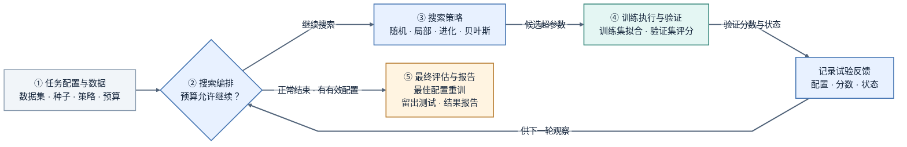

# EnNeuro AutoML Agent 架构与流程

五个模块共用一条调参闭环。执行器返回验证分数和试验状态，编排器保存反馈并决定是否继续。搜索结束且有有效配置时，才用留出测试集评估最终模型。事件日志和试验报告也记录失败或超时。

```mermaid
%%{init: {"theme":"base","themeCSS":".edgeLabel rect { fill: #FFFFFF !important; opacity: 1 !important; }","flowchart":{"curve":"linear","htmlLabels":false,"nodeSpacing":36,"rankSpacing":48},"themeVariables":{"fontFamily":"Microsoft YaHei, Noto Sans CJK SC, sans-serif","fontSize":"17px","lineColor":"#52647A","primaryTextColor":"#14243A","edgeLabelBackground":"#FFFFFF","background":"#FFFFFF"}}}%%
flowchart LR
    A["① 任务配置与数据<br/>数据集 · 种子 · 策略 · 预算"]:::input
    B{"② 搜索编排<br/>预算允许继续？"}:::control
    C["③ 搜索策略<br/>随机 · 局部 · 进化 · 贝叶斯"]:::control
    D["④ 训练执行与验证<br/>训练集拟合 · 验证集评分"]:::execution
    E["记录试验反馈<br/>配置 · 分数 · 状态"]:::control
    F["⑤ 最终评估与报告<br/>最佳配置重训<br/>留出测试 · 结果报告"]:::output

    A --> B
    B -->|"继续搜索"| C
    C -->|"候选超参数"| D
    D -->|"验证分数与状态"| E
    E -->|"供下一轮观察"| B
    B -->|"正常结束 · 有有效配置"| F

    classDef input fill:#F1F5F9,stroke:#8396AA,stroke-width:1.5px,color:#14243A;
    classDef control fill:#E8F1FF,stroke:#4575B2,stroke-width:1.8px,color:#14243A;
    classDef execution fill:#E4F6F3,stroke:#38877B,stroke-width:1.8px,color:#14243A;
    classDef output fill:#FFF4E1,stroke:#B87D32,stroke-width:1.8px,color:#14243A;
    linkStyle default stroke-width:2.2px;
```
