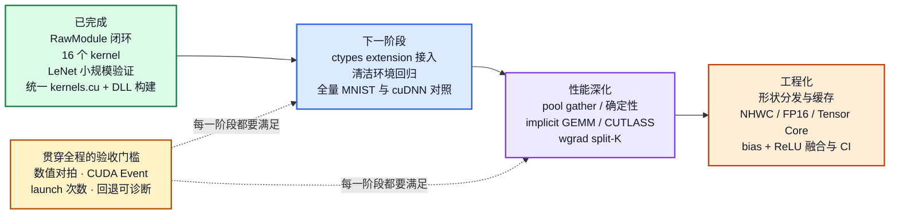

# CUDA C 改写后续路线图

路线图把当前交付与下一阶段验收、性能深化和工程化目标分开，避免把设计计划误写成已完成成果。

```mermaid
flowchart LR
    done["已完成<br/>RawModule 闭环<br/>16 个 kernel<br/>LeNet 小规模验证<br/>统一 kernels.cu + DLL 构建"]:::done --> next["下一阶段<br/>ctypes extension 接入<br/>清洁环境回归<br/>全量 MNIST 与 cuDNN 对照"]:::next
    next --> perf["性能深化<br/>pool gather / 确定性<br/>implicit GEMM / CUTLASS<br/>wgrad split-K"]:::perf
    perf --> prod["工程化<br/>形状分发与缓存<br/>NHWC / FP16 / Tensor Core<br/>bias + ReLU 融合与 CI"]:::prod
    risk["贯穿全程的验收门槛<br/>数值对拍 · CUDA Event<br/>launch 次数 · 回退可诊断"]:::gate
    risk -."每一阶段都要满足".-> next
    risk -."每一阶段都要满足".-> perf
    classDef done fill:#DCFCE7,stroke:#15803D,color:#111827,stroke-width:2px;
    classDef next fill:#DBEAFE,stroke:#2563EB,color:#111827,stroke-width:2px;
    classDef perf fill:#EDE9FE,stroke:#7C3AED,color:#111827,stroke-width:2px;
    classDef prod fill:#FFEDD5,stroke:#C2410C,color:#111827,stroke-width:2px;
    classDef gate fill:#FEF3C7,stroke:#B45309,color:#111827,stroke-width:2px;
```
